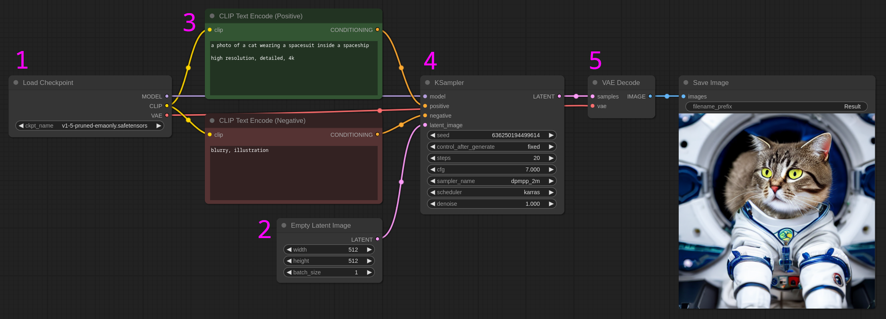
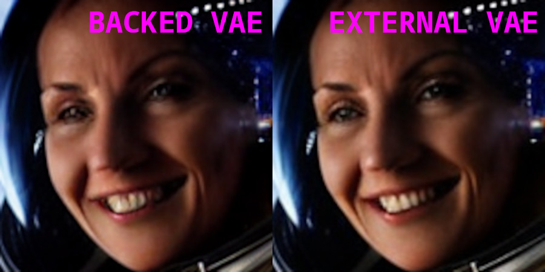
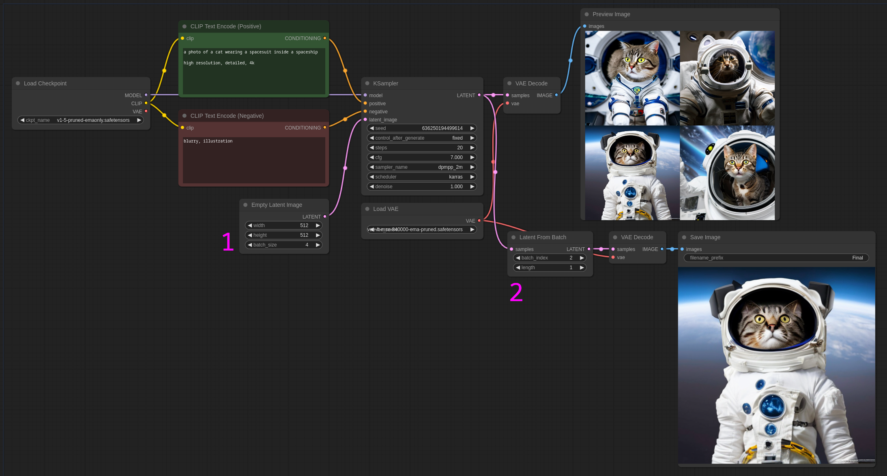
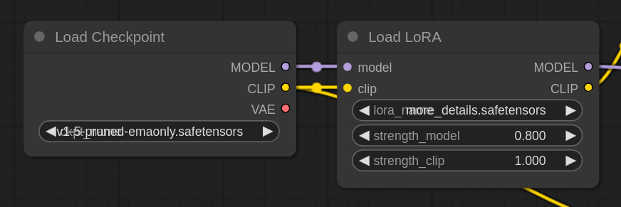
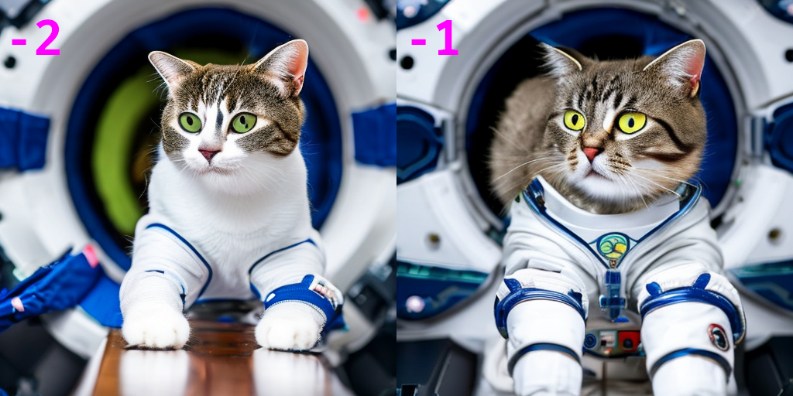
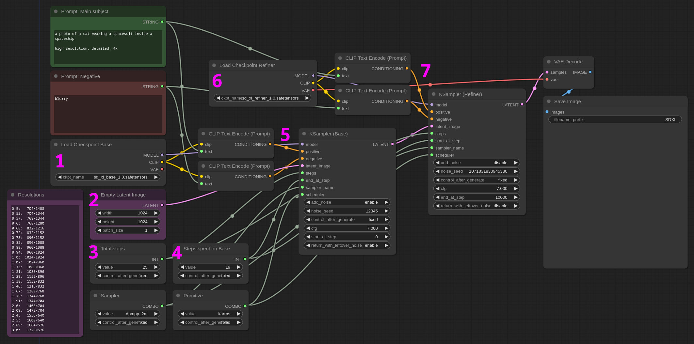
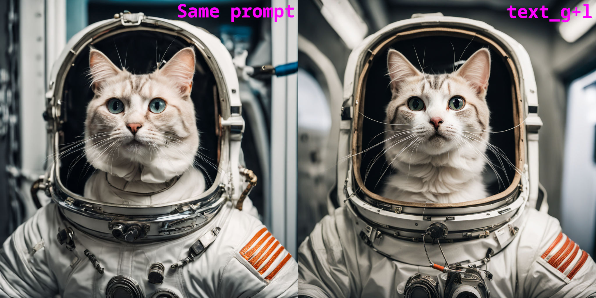

<!-- TOC -->

- [Basic](#basic)
    - [Basic SD1.x Workflow](#basic-sd1x-workflow)
    - [Basic SD1.x with external VAE](#basic-sd1x-with-external-vae)
    - [Working with a batch of images](#working-with-a-batch-of-images)
    - [Parametrize node options](#parametrize-node-options)
    - [Apply Lora](#apply-lora)
    - [Apply multiple Loras](#apply-multiple-loras)
    - [CLIP skip Set CLIP last layer](#clip-skip-set-clip-last-layer)
    - [SDXL Simple](#sdxl-simple)
    - [SDXL Advanced](#sdxl-advanced)
    - [SDXL Text_G + Text_L](#sdxl-text_g--text_l)
    - [SDXL Base only](#sdxl-base-only)
- [Experiments](#experiments)
    - [Compare Samplers](#compare-samplers)
    - [Compare checkpoints](#compare-checkpoints)
    - [Save each denoise step](#save-each-denoise-step)

<!-- /TOC -->

# Basic

This section contains the workflows for basic text-to-image generation in ComfyUI. These are the scaffolding for all your future node designs.

The heading links directly to the JSON workflow.

## [Basic SD1.x Workflow](./basic_workflow.json)

The easiest image generation workflow. We will examine each aspect of this first workflow as it will give you a better understanding on how Stable Diffusion works but it's not something we will do for every workflow as we are mostly learning by example.

1. You start by loading a checkpoint which is the brain of the generation. For this tutorial be sure to have at least the file [v1-5-pruned-emaonly.safetensors](https://huggingface.co/runwayml/stable-diffusion-v1-5/resolve/main/v1-5-pruned-emaonly.safetensors) installed in your `ComfyUI/models/checkpoints` directory, but you can use whatever SD1.5 model you want.

2. Next we set the **Latent** size. It is important to understand the difference between *latent and pixel space*. The image is actually processed in a special environment that contains information useful to the model but not very much to us. This environment is the **Latent**. Once the computation is finished the data can be converted into something we can see, ie: **pixels**. This phase happens at step #5 "Vae Decode" in the picture above.

3. Time to add a Positive and Negative prompt. The text has to interpreted into a language the machine can understand. This translation is performed by CLIP models (hence the node name "CLIP Text Encode").

4. If the checkpoint is the brain, the **KSampler** is the heart. We now have all the data needed to crunch some numbers. The main parameters we need to set are the following:
    - **Seed**: this is the number used to seed the random number generation. Different seed = different image.
    - **Steps**: number of steps used to reach the final image. More steps require more time to compute but might grant a better composition. That greatly varies based on the prompt, the sampler and the checkpoint. If usure start with a 15-20 value.
    - **CFG**: The *Classifier-free Guidance* scale defines how close the image will be to your prompt. The lower the number the closer the model will stay to your directions (ie: it has less time to iterate on the concept). If you are trying to create complex images the model is not directly trained for, a higher CFG might help with the composition. Generally a value between 4 and 9 should cover all your use cases but it depends on many factors including the checkpoint you are using.
    - **Sampler** and **Scheduler** together are deputized to carry on the noise in the latent space until the final image is reached withint the defined steps. Some samplers may reach a good result in less steps but might be slower. Generally speaking there's not a "best" sampler but good overall options are "euler ancestral" and "dpmpp_2m karras" but be sure to experiment with all of them.

5. Finally the latent is converted into an image we can see thank to the VAEDecode node. Note that the conversion is lossy and it's computationally heavy, so during your experiments the more you can work within the latent space the better.

:warning: **Important:** In ComfyUI the random number generation is different than other UIs, that makes it very difficult to recreate the same image generated --for example-- on A1111.

:bulb: **Tip:** The connection "dots" on each node has a color, that color helps you understand where the node should be connected to/from.

:bulb: **Tip:** If the image looks oversaturated or has too much contrast, try to lower the CFG scale.

:bulb: **Tip:** Remember you can always drag and drop images onto your ComfyUI workspace and the whole node layout will appear. This is also true for the screenshot of all the workflows you see in this repository!

## [Basic SD1.x with external VAE](./basic_workflow_ext_vae.json)

This workflow is substantially identical to the previous one with the exception that we now use an external VAE model instead of the one baked inside the original checkpoint. This is very important because the VAE is a crucial element of SD image creation.

An overall very good external VAE is provided by StabilityAI and it's called [vae-ft-mse-840000-ema-pruned.safetensors](https://huggingface.co/stabilityai/sd-vae-ft-mse-original/blob/main/vae-ft-mse-840000-ema-pruned.safetensors). Be sure to download it and place it in the `ComfyUI/models/vae` directory.

If the checkpoint doesn't include a proper VAE or when in doubt, the file above is a good all around option. In the picture below you can see the difference a VAE can do. On the right the eyes and the teeth are more defined.

## [Working with a batch of images](./basic_latent_batch.json)

A very common practice is to generate a batch of 4 images and pick the best one to be upscaled and maybe apply some inpaint to it. ComfyUI offers this option through the "Latent From Batch" node.

The workflow is similar to the base one but:

1. When we define the latent size we can also tell the number of pictures we want to create; in this case we set **batch_size** to 4.

2. When the KSampler has finished we can display the four images normally as we did before and extract only the one picture we like. This can be done with the **LatentFromBatch** node. In this case we want the third image (**batch index=2** as we start counting from 0). **Length** is how many pictures we want to extract as it would be possible to filter more than one to do extra computation on them.

**Note:** You can enable/disable nodes by selecting them and pressing <kbd>CTRL</kbd> + <kbd>M</kbd>. In the example above you can disable the LatentFromBatch and the connected VAEDecode and SaveImage and re-enable them only when you've found the image you are interested in.

:bulb: **Tip:** if you double-click an empty space of the work area you'll be able to add a node by searching it by name.

## [Parametrize node options](./basic_parametrized.json)

Simple example workflow to show that most of the nodes parameters can be converted into an input that you can connect to an external value.

That is extremely usefuly when working with complex workflows as it lets you reuse the same options for multiple nodes. More interesting use cases can be found below in the [experiments section](#Experiments).

To convert a parameter to input right click the node and select `convert [parm name] to input`. You can then create a **PrimitiveNode** and connect it to the newly create input.

To convert the input back to an input box, right click again and select `convert [parm name] to widget`.

## [Apply Lora](./basic_lora.json)

Also Loras are nodes in ComfyUI.

You can increase/decrease the effect of the lora with the `strength_model` and `strength_clip` parameters. You normally want them to be the same value but you can play with them to get different results. Check [this interesting article](https://github.com/cloneofsimo/lora#what-happens-to-text-encoder-lora-and-unet-lora) about it.

**Note:** For this workflow we are using [Studio Ghibli Lora](https://civitai.com/models/6526/studio-ghibli-style-lora).

## [Apply multiple Loras](./multiple_loras.json)

You can of course apply multiple Loras with different weights. This workflow shows you how.

We added the [More Details Lora](https://civitai.com/models/82098/add-more-details-detail-enhancer-tweaker-lora) to the *Studio Ghibli* one.

## [CLIP skip (Set CLIP last layer)](./clip_skip.json)

A common practice is to do what in other UIs is sometiles called "clip skip". In ComfyUI you can achieve the same result with the **CLIP Set Last Layer** node. It is expressed with a negative value where -1 means no "CLIP skip".

You can imagine CLIP as a series of layers that incrementally describe your prompt more and more precesely. Say you have a prompt like "A young woman standing in a grass field". The first layer could be "a woman", in the second we add that she's "young" in the third that she's "standing in a grass field" and so on. It's not that simple but just to give you an idea.

By setting the last layer you are actively limiting how deep the CLIP can go in describing your image. Sometimes --also depenting on the checkpoint-- skipping the last layer (-2) can lead to better results.

## [SDXL Simple](./SDXL_simple.json)

A quick note before delving into the SDXL workflows. You'll notice that there are many ways to work with SDXL and we are going to explore only a few. This is precisely the ComfyUI strength and flexibility we were talking about in the [introduction](../README.md). You are free to explore and experiments with different workflows to find the one that best suits your needs.

**Note:** For the SDXL examples we are using [sd_xl_base_1.0.safetensors](https://huggingface.co/stabilityai/stable-diffusion-xl-base-1.0/resolve/main/sd_xl_base_1.0.safetensors) and [sd_xl_refiner_1.0.safetensors](https://huggingface.co/stabilityai/stable-diffusion-xl-refiner-1.0/resolve/main/sd_xl_refiner_1.0.safetensors) files, be sure to download them and place them into the `ComfyUI/models/checkpoints` directory.

You'll also find the same files ending with `_0.9vae`, those have a better VAE already baked into them or you could use an [external VAE](https://huggingface.co/stabilityai/sdxl-vae/resolve/main/sdxl_vae.safetensors) like we did for the SD1.x model.

The simple workflow is similar to what is suggested in the [official repository](https://comfyanonymous.github.io/ComfyUI_examples/sdxl/). SDXL is composed by two models, even though you can use just the Base model the refiner might give your image that extra crisp detail.

The layout looks like this:

 

1. We load the **base model**

2. Set the **latent size**. Remember that SDXL is trained with 1024x1024 pictures so that is a good starting resolution. At the end of this section you'll find a reference with all the resolutions SDXL can work with (with different grades of success).

3. **Total number of steps**. Note that we parametrized a few values so we can reuse them easily (see [section above](#Parametrize-node-options)).

4. The image creation is split into two phases: Base and Refiner. This parameter defines how many steps are spent on the Base model and how many on the refiner. **On a total of 25 steps we decided to spend 19 on the Base** and consequently 6 on the Refiner. A good rule of thumb is to let the base model do 80% of the work, but as always: experiment.

5. This time we are using the **Advanced KSampler**, it is a very important node that lets us more precicely work with the sampler. We set the total number of steps to 25 but we instruct the sampler to stop at step 19. Note that we need to set `return_with_leftover_noise` to `enable` so the refiner can work where the base lefts off.

6. We load the refiner model.

7. We take the left over latent from the base ksampler and pass it directly to the refiner. We still set the total step to 25 but we tell the sampler to start from step 19, which is where we left the base. Note that we are using the sampler and scheduler that we used in the base KSampler node. Some samplers are compatible with each other but it might be best to use the same.

All is left to do is to Decode the VAE and save the image. You can use the VAE backed in either the Base or the Refiner or use an external VAE.

SDXL resolutions

| ratio | resolution
| ----- | ----------
| 0.5   | 704×1408
| 0.52  | 704×1344
| 0.57  | 768×1344
| 0.6   | 768×1280
| 0.68  | 832×1216
| 0.72  | 832×1152
| 0.78  | 896×1152
| 0.82  | 896×1088
| 0.88  | 960×1088
| 0.94  | 960×1024
| 1.0   | 1024×1024
| 1.07  | 1024×960
| 1.13  | 1088×960
| 1.21  | 1088×896
| 1.29  | 1152×896
| 1.38  | 1152×832
| 1.46  | 1216×832
| 1.67  | 1280×768
| 1.75  | 1344×768
| 1.91  | 1344×704
| 2.0   | 1408×704
| 2.09  | 1472×704
| 2.4   | 1536×640
| 2.5   | 1600×640
| 2.89  | 1664×576
| 3.0   | 1728×576

## [SDXL Advanced](./SDXL_advanced.json)

SDXL introduces two new **CLIP Text Encode nodes**, one for the base, one for the refiner. They add `text_g` and `text_l` prompts and width/height conditioning.

**Text G** is the *natural language* prompt, you just talk to the model by describing what you want like you would do to a person. **Text L** takes concepts and words like we are used with SD1.x/2.x. Various experiments lead us to believe that setting the same value for G and L generally works better or anyway the models seem to understand better what we want. Of course experiment with all options, below we are also offering a workflow that splits the two prompts.

It is not entirely clear how the dimension conditioning influences the composition. By preliminary testing it seems that setting `width/height` and `target_width/height` to 4096 tends to generate slightly sharper details. To keep the correct aspect ratio at more extreme image resolution it might be a good idea to set CLIP widths and heights to 4x the Latent size.

## [SDXL Text_G + Text_L](./SDXL_text_g-l.json)

This workflow lets you experiment with different prompts for `text_g` and `text_l` (see previous workflow for more details). Below the difference in using the same text_l/g vs two different prompts.

 

## [SDXL Base only](./SDXL_base_only.json)

SDXL can also be used only with the base model. This can be useful if you have limited resources or experimenting in general.

# Experiments

In the experiments we are applying what we've learned in the category to try to explore more advanced workflows.

## [Compare Samplers](./experiments/compare_samplers.json)

In this workflow we are checking the difference between four samplers. We use the same checkpoint, number of steps and CFG scale to see which sampler offers the best result.

Image comparison

## [Compare checkpoints](./experiments/compare_checkpoints.json)

In this workflow we are comparing two checkpoints using the same prompt and sampler options: [Absolute Realisty](https://civitai.com/models/81458/absolutereality) and [Realistic Vision](https://huggingface.co/SG161222/Realistic_Vision_V3.0_VAE).

Note that all models in the workflow need to be loaded into memory so it can become resource hungry to compare checkpoints.

## [Save each denoise step](./experiments/save_noise_steps.json)

This workflow saves each step of the denoising process into the `output` directory. To automate the process select the `Extra options` in the main ComfyUI menu, and set the batch count to the number of total steps (20 in this example).

Remember you need to set the **primitive** `end_at_step` back to 1 each time you generate a new image.