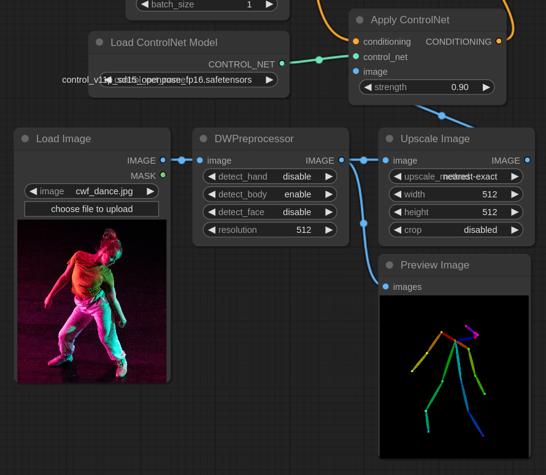
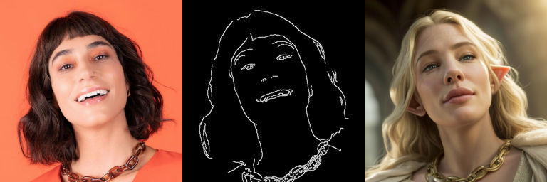

<!-- TOC -->

- [Guided Composition](#guided-composition)
    - [Pose](#pose)
    - [Canny](#canny)
    - [Depth](#depth)
- [Experiments](#experiments)
    - [Multiple Control nets](#multiple-control-nets)

<!-- /TOC -->

# Guided Composition

This is where things get interesting. Text prompt or image-to-image can only bring you so far, the secret to a masterpiece lies in ControlNets and similar guided compositions.

For most of the workflows in this section you'll need the [ComfyUI's ControlNet Auxiliary Preprocessors extension](https://github.com/Fannovel16/comfyui_controlnet_aux). Be sure to have it installed before going any further.

As always titles link directly to the workflow.

## [Pose](./pose.json)

The workflow for all control nets is basically the same, what changes is the model that you use for processing and possibly the preprocessor.

In this first example we are using openpose to convert a *stick man* to an actual character.

You'll notice that each Controlnet or T2Adapter can be used with multiple preprocessors. For the pose the `DWPreprocessor` is very effective and generally yields to better results than the `OpenPose preprocessor`.

## [Canny](./canny.json)

And incredibly effective and cheap in terms of resources used is **canny**. The preprocessor converts the image in a simplified "scribble" of the original image that can be used as reference for a new composition.

## [Depth](./depth.json)

The depth controlnet is a very effective controlnet that lets you define shapes and volumes in a 3D space. A good preprocessor for depth maps is **Zoe**.

:point_right: **Note:** It's not necessary to use a preprocessor as long as you have the right reference image. If you use Blender there's [a very interesting tool](https://toyxyz.gumroad.com/l/ciojz) for it. [PoseMy.Art](https://posemy.art/) lets you create characters with an easy to use interface. [Cascadeur](https://cascadeur.com/) is another professional solution for posing characters.

:bulb: **Tip:** For better results remember that you can always chain multiple controlnets. Check the [experiments](#experiments) below.

:bulb: **Tip:** Remember to play with the strength of the `Apply ControlNet` node. It's usually a good idea to lower the strength to give the model a little leeway.

:warning: **Important:** The controlnet has to match the version of the checkpoint that you are using. For SDXL you need controlnets specifically trained for it, same as v1.5 and 2.1.

# Experiments

## [Multiple Control nets](./experiments/multiple_controlnets.json)

It's of course possible to chain multiple controlnets. This example we used **openpose** to pose the character and **shuffle** to spice up the composition.