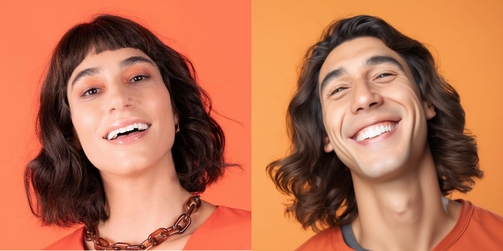
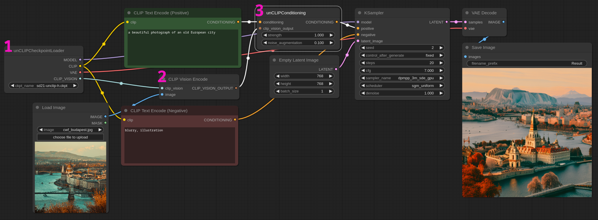
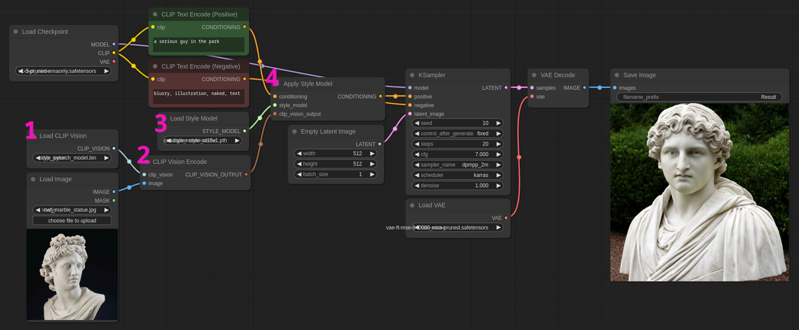
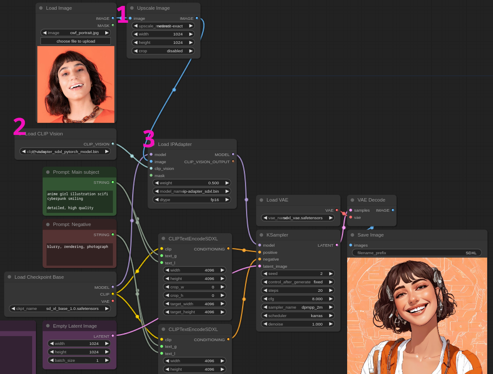
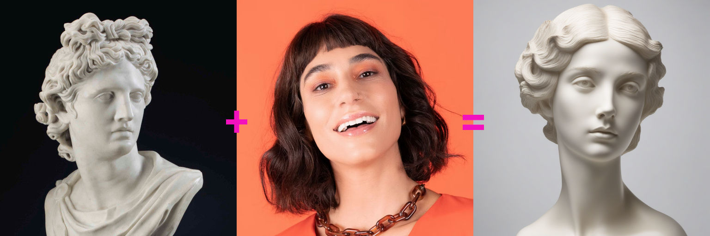
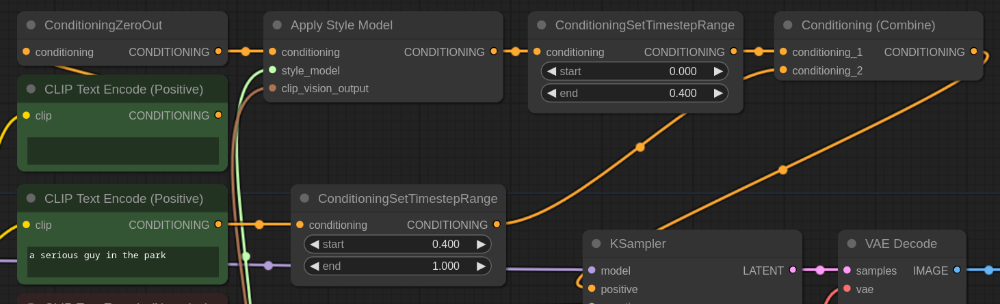

# Image-to-Image Conditioning

A picture is worth a thousand words, sometimes starting from a reference image is more efficient than trying your luck with simple [text-to-image](../text2img/README.md).

In this section we'll explore various image-to-image techniques.

If you want to follow the following examples be sure to download the content of the [input](../input/) directory of this repository and place it inside `ComfyUI/input/`.

## [Simple Img2Img](./img2img_SDXL.json)

The easiest of the image to image workflows is by "drawing over" an existing image using a *lower than 1* denoise value in the sampler.

The lower the denoise the closer the composition will be to the original image.

We can of course augment the generation with proper prompting. In this workflow we use a base image of a portrait of a woman to create a similar image of a man.

:point_right: **Note:** We are using SDXL for this example. The latent size is `1024x1024` but the conditioning image is only `512x512`. It is a good idea to always work with images of the same size. That's why in this example we are scaling the original image to match the latent. **This is generally true for every image-to-image workflow**, including ControlNets especially if the aspect ratio is different.

## [unCLIP model](./conditioning_unclip.json)

Sometimes you want to create an image based on the style of a reference picture. You are not painting over but taking inspiration from a source.

This can be done with [unCLIP models](https://huggingface.co/stabilityai/stable-diffusion-2-1-unclip/tree/main). In this example we are using the `sd21-unclip-h.ckpt` checkpoint.

1. We load the checkpoint with the `unCLIPCheckpointLoader` node. Note that it is based on SD2.1 so we use `768x768` latent size that is the resolution the model is trained for.

2. We use a `CLIP Vision Encode` node to encode the reference picture for the model.

3. The conditioning happens on the `unCLIPConditioning` node. `noise_augmentation` defines how close to the original the new image will be with `0` being the most faithful. It is generally a good idea to set this value to `0.1-0.3` just to give some leeway to the sampler. `strength` is the conditioning strength in relation to the other conditionings (in this example the text clip). It's like setting the weight of a text inside a prompt, eg: `(red hat:1.2)`.

:bulb: **Tip:** You'll notice that there are two unCLIP models available: `sd21-unclip-l.ckpt` and `sd21-unclip-h.ckpt`. Generally for one off image you want to use the `-h` variant that is more accurate. The `-l` model was created for when resources are scarse or extreme speed is essential.

## [Style Model](./conditioning_style.json)

The Style model works similarly to unCLIP but it's a CLIP Vision conditioning and can be used with any SD1.5 model.

For this to work you need the [CLIP Vision model]() in the `ComfyUI/models/clip_vision` directory and the style model itself in `ComfyUI/models/style_models`.

1. Load the CLIP Vision model.

2. Encode the source image for the model to use.

3. Load the Style model

4. Connect your prompt to the `Apply style model` node and then to the KSampler positive. Note that albeit the node doesn't offer a `strength` option you can technically fine tune the effect with [timestepping](../text2img/README.md#timestepping). Check the [experiments](#experiments) for some examples.

:point_right: **Note:** The style model --like many of the "in the style of..." img2img-- can't apply a style of something it doesn't understand. A picture of a famous painting or of a person will be easy to process but something more exotic, abstract or unintelligible might lead to underwhelming results.

## [IPAdapter image + text](./IPAdapter_basic_SDXL.json)

[IPAdapter](https://github.com/tencent-ailab/IP-Adapter) are a series of lightweight and rather effective models for image conditioning. They can be used alone or in conjuction with text and ControlNets.

In this workflow we offer a simple image+text conditioning example. Also check the [experiments](#experiments) for more use cases. We are using SDXL but models for SD1.5 are also available.

You need to download [these pretrained models](https://huggingface.co/h94/IP-Adapter/tree/main) on huggingface and install the [ComgyUI extension](https://github.com/laksjdjf/IPAdapter-ComfyUI).

Note that **you need both the model and the clip vision encoder**. Eg: for SDXL download the [ip-adapter_sdxl.bin](https://huggingface.co/h94/IP-Adapter/resolve/main/sdxl_models/ip-adapter_sdxl.bin) file and place it under the IPAdapter extension directory `ComfyUI/custom_nodes/IPAdapter-ComfyUI/models`; then you need the image encoder [pytorch_model.bin](https://huggingface.co/h94/IP-Adapter/resolve/main/sdxl_models/image_encoder/pytorch_model.bin) and place it under `ComfyUI/models/clip_vision/`. I recommend renaming the image encoder to something easy to remember like `IP-Adapter_sdxl_pytorch_model.bin`. You then need to repeat the process for the SD1.5 models if you need them.

The workflow itself is very simple:

1. Load an image, in this example we are also upscaling it to the same latent dimension (it's generally a good idea albeit not always necessary).

2. Load the clip vision model. Remember to use the model that matches your checkpoint (SDXL or SD1.5).

3. Load and apply the IPAdapter. Again be sure to use the right model for the checkout. The `weight` is the strength of the image conditioning.

As you can see the IPAdapter is tapped between the load checkout node and the ksampler, not the conditionings.

## [SDXL Revision](./revision_SDXL.json)

Stability AI released [the Revision model](https://huggingface.co/stabilityai/control-lora#revision) that is similar to the other methods we explored in this section but dedicated to the SDXL.

Revision is used for image (including multiple images) and image+text conditioning and it's also a rather effective tool for creating image variations.

Download the [clip vision model](https://huggingface.co/stabilityai/control-lora/resolve/main/revision/clip_vision_g.safetensors) and place it in the `ComfyUI/models/clip_vision` directory.

The workflow is similar to [unCLIP](#unclip-model) but the base checkpoint is SDXL base. In this example we are merging the style of two images.

As per unCLIP, `noise_augmentation` determines the closeness to the reference image and `strength` the weight of the conditioning.

:point_right: **Note:** to eliminate any interference from the text clip we also use `ConditioningZeroOut`, this is optional and used exclusively for the purpose of this example that is meant as a pure image+image conditioning without any other external influence. You can further alter the image generation by elimitating the zero out nodes and by adding a custom prompt.

# Experiments

## [unCLIP multiple images](./experiments/conditioning_unclip_multiple_imgs.json)

Use the unCLIP model to merge the style of two images.

## [unCLIP with SDXL refiner augmentation](./experiments/unclip_SDXL_refiner.json)

This is a fun experiment. We fuse two images with unclip and then augment the resolution with the SDXL refiner.

## [IPAdapter image variations](./experiments/IPAdapter_img_variations.json)

In this SD1.5 workflow we first create an image with [dreamshaper](https://civitai.com/models/4384/dreamshaper) and then use IPAdapter to create 4 variations of that image with an additional textual conditioning.

## [IPAdapter + Canny control net](./experiments/IPAdapter_canny.json)

This workflow uses a conditioning image for IPAdapter and adds a Canny control net to further enhance the composition.

For this example you need to download the [canny controlnet](https://huggingface.co/lllyasviel/ControlNet-v1-1/resolve/main/control_v11p_sd15_canny.pth) and place it under `ComfyUI/models/controlnet`. We use again the [dreamshaper](https://civitai.com/models/4384/dreamshaper) checkpoint.

## [Timestepping a Style model](./experiments/timestepping_style_model.json)

Sometimes it seems impossible to fine tune some conditioning nodes, like for example the Style model we've seen earlier.

With a little trick and timestepping it is actually possible to fine tune any conditioning node.

In this experiment we use one prompt as text conditioning then we connect a zeroed-out empty prompt to the style model. We can now timestep the two conditionings to easily calibrate the end result.
