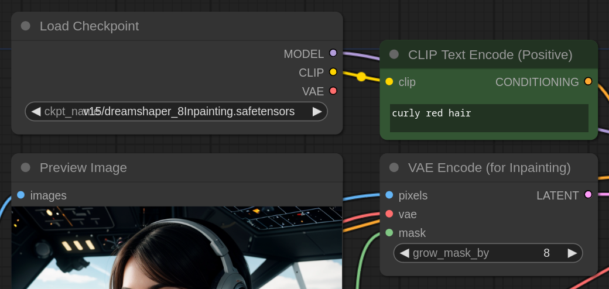
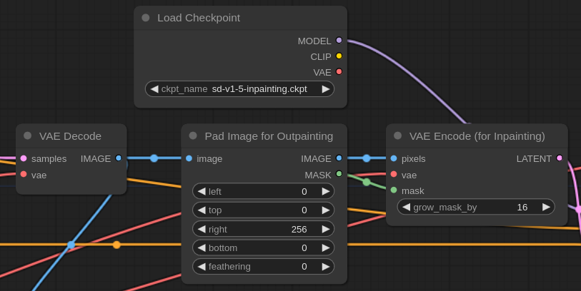
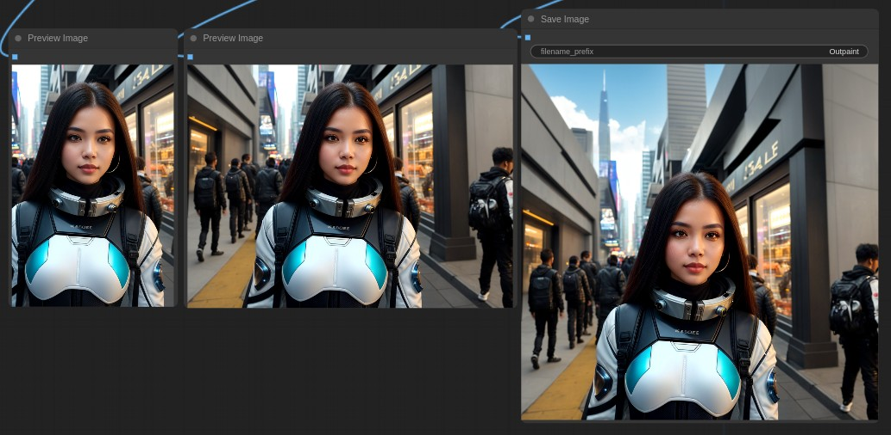
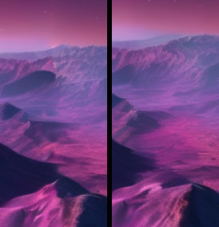
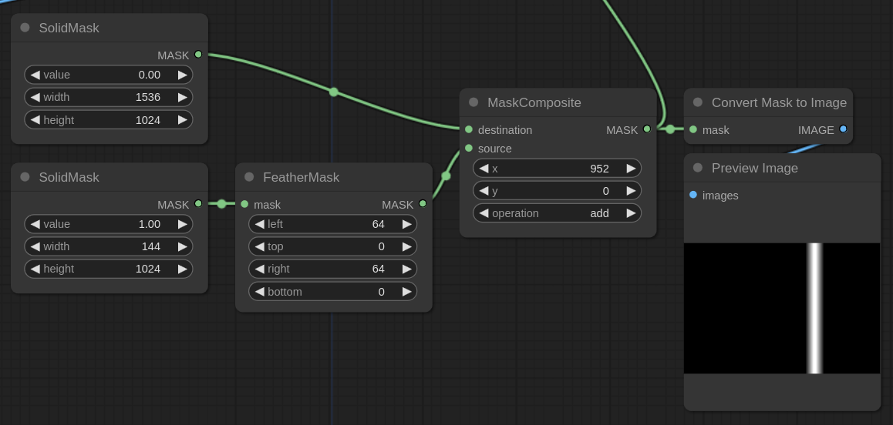

<!-- TOC -->

- [In/Out Painting](#inout-painting)
    - [Inpainting](#inpainting)
    - [Outpainting](#outpainting)
    - [Inpainting SDXL with SD1.5](#inpainting-sdxl-with-sd15)
- [Experiments](#experiments)
    - [Multiple outpaints](#multiple-outpaints)
    - [Outpaint seam-fix](#outpaint-seam-fix)

<!-- /TOC -->

# In/Out Painting

It comes the time when you need to change a detail on an image, or maybe you want to expand on a side. Inpainting is very effective in Stable Diffusion and the workflow in ComfyUI is really simple.

Note that when inpaiting it is better to use checkpoints trained for the purpose. They are generally called with the base model name plus `inpainting`. While it's true that normal checkpoints can be used for inpainting, the end result is generally better with a specific model. For these workflows we use mostly [DreamShaper Inpainting](https://civitai.com/models/4384?modelVersionId=131004).

:bulb: **Tip:** Most of the image nodes integrate a mask editor. Right click on any image and select `Open in Mask Editor`. Alternatively you can create an alpha mask on any photo editing software. [GIMP](https://www.gimp.org/) is a free one and more than enough for most tasks.

The titles link directly to the related workflow.

## [Inpainting](./inpaint.json)

The workflow is very simple, the only thing to note is that to encode the image for inpainting we use the `VAE Encode (for Inpainting)` node and we set a `grow_mask_by` to 8 pixels. It is generally a good idea to grow the mask a little so the model "sees" the surrounding area.

It's not unusual to get a seamline around the inpainted area, in this case we can do a low denoise second pass (as shown in the example workflow) or you can simply fix it during the upscale.

Below you can see the original image, the mask and the result of the inpainting by adding a "red hair" text prompt.

## [Outpainting](./outpaint.json)

Outpainting is similar to inpainting, we still use an inpainting model for optimal results and the workflow is identical with the exception of the `Pad Image for Outpainting` node.

That node lets us add empty space to the sides of an image for the outpainting magic to happen. It offers a feathering option but it's generally not needed and you can actually get better results by simply increasing the `grow_mask_by` in the `VAE Encode (for Inpainting)` node.

## [Inpainting SDXL with SD1.5](./SDXL_inpaint_SD15.json)

At the time of this writing SDXL only has a beta [inpainting model](https://huggingface.co/diffusers/stable-diffusion-xl-1.0-inpainting-0.1) but nothing stops us from using SD1.x/2.x for inpainting. This workflow shows you how and it also adds a final pass with the SDXL refiner to fix any possible seamline generated by the inpainting process.

# Experiments

## [Multiple outpaints](./experiments/multiple_outpaints.json)

Of course it's possible to chain multiple outpaints. This way we are able to customize the prompt for each pass. The result is of great effect.

## [Outpaint seam-fix](./experiments/outpaint_seam_fix_SDXL.json)

In this example we use SDXL for outpainting. It happens to get a seam where the outpainting starts, to fix that we apply a masked second pass that will level any inconsistency.

In the following image you can see how the workflow fixed the seam. Before/after.

The only interesting bit is how we created the mask for overlapping area. You can of course just roughly paint it by hand with the *Mask Editor* but a better way is to use a series of mask related nodes as shown in the picture.

