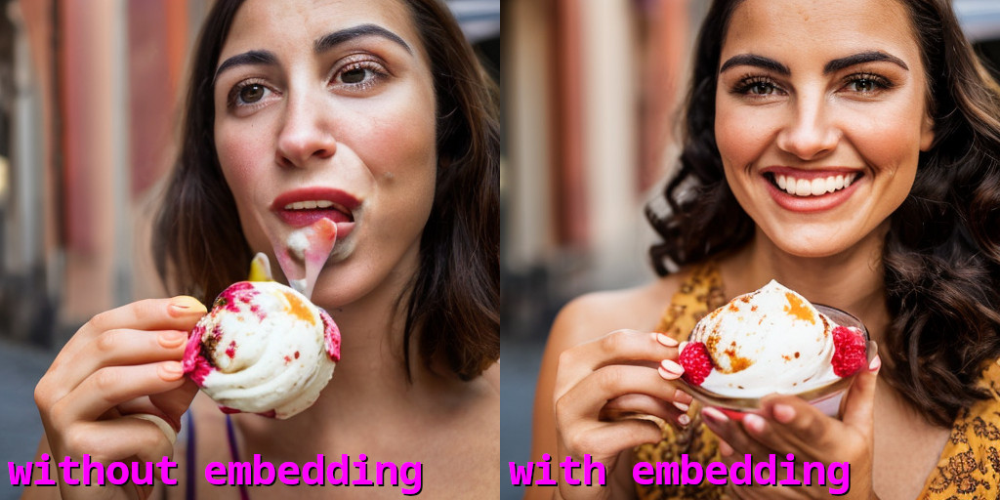
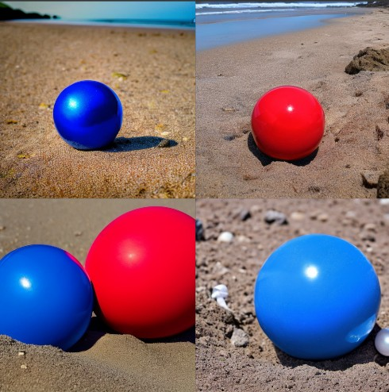
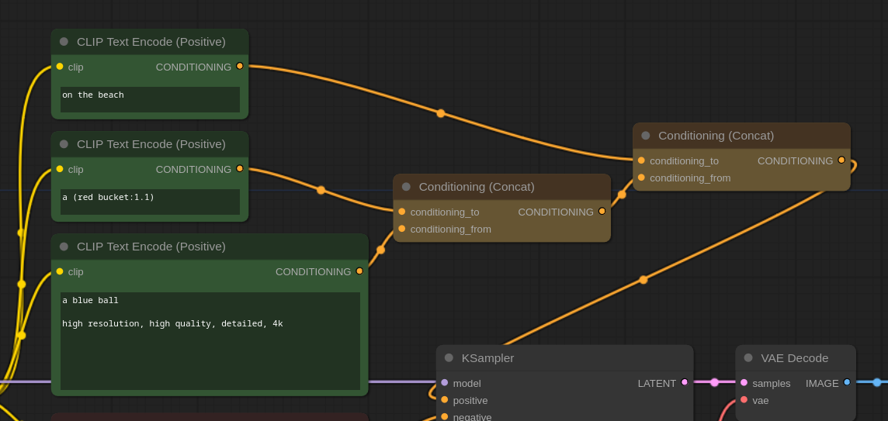
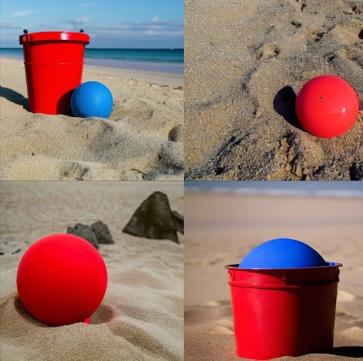
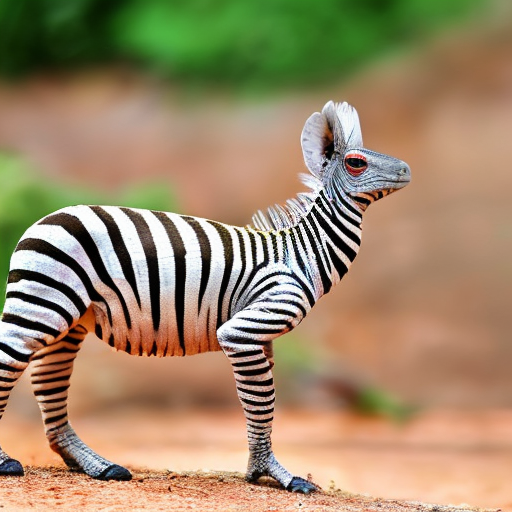
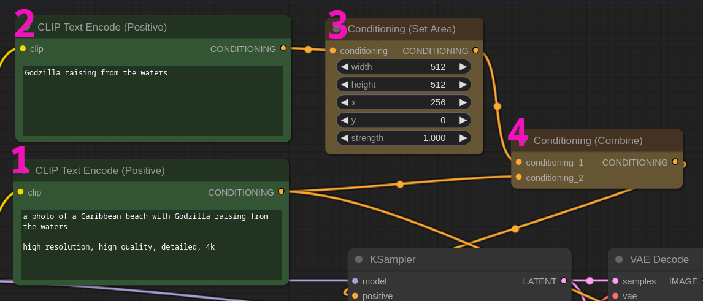
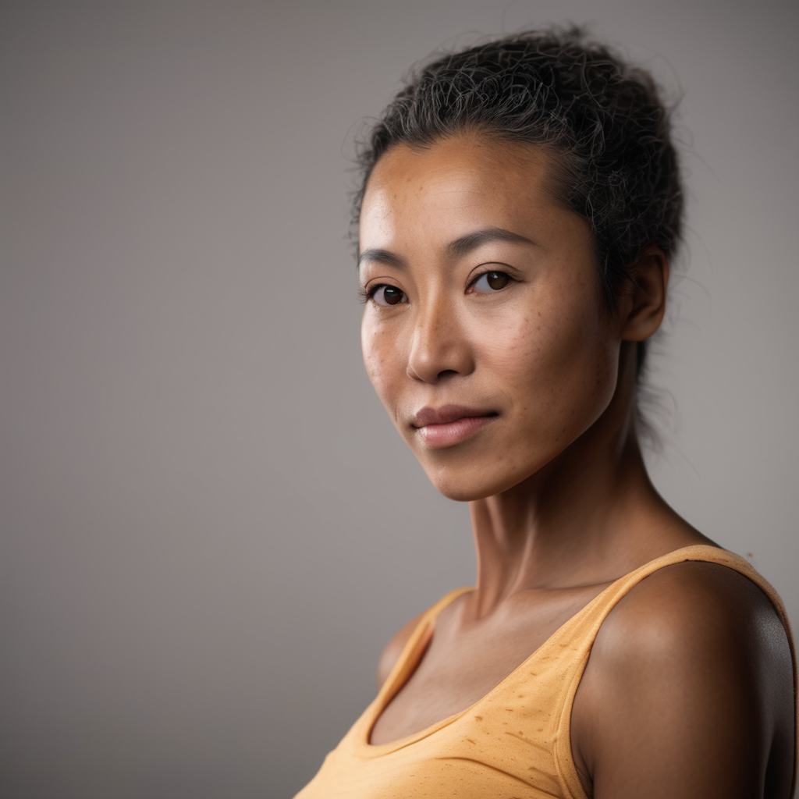
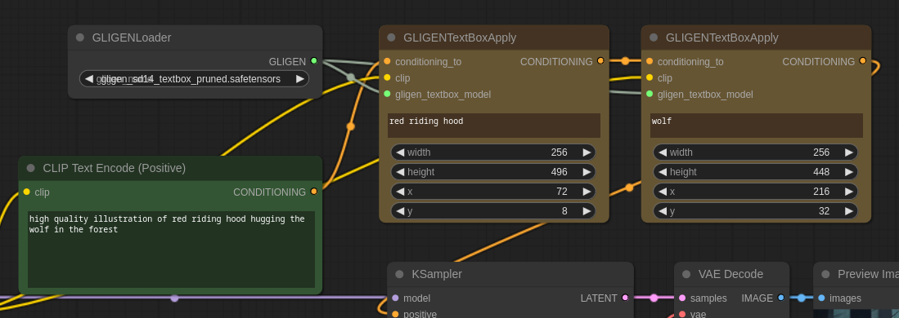

<!-- TOC -->

- [Text to Image](#text-to-image)
    - [Word weighting](#word-weighting)
    - [Embedding/Textual inversion](#embeddingtextual-inversion)
    - [Conditioning Concat](#conditioning-concat)
    - [Conditioning Average](#conditioning-average)
    - [Area conditioning](#area-conditioning)
    - [Timestepping](#timestepping)
    - [GLIGEN Box](#gligen-box)
- [Experiments](#experiments)
    - [Compare merging methods](#compare-merging-methods)
    - [Blank token trick](#blank-token-trick)
    - [Horrors in the negative](#horrors-in-the-negative)
    - [Area conditiong vs GLIGEN box](#area-conditiong-vs-gligen-box)

<!-- /TOC -->

# Text to Image

Text prompting is the foundation of Stable Diffusion image generation but there are many ways we can interact with text to get better resutls.

These workflows explore the many ways we can use text for image conditioning.

As always, the heading links directly to the workflow.

:warning: **Important:** It's not always easy to forsee which conditioning method is better for a give task. Often results blur together and predicting what the model will do is impossible. The only way is to experiment, fortunately ComfyUI is very good at comparing workflows, check the [Experiments](#experiments) section for some examples.

## [Word weighting](./word_weighting.json)

This this very simple and widespread but it's worth a mention anyway.

You can give higher (or lower) weight to a word or a series of words by putting them inside parentheses: `closeup a photo of a (freckled) woman smiling`.

In this example we are giving a slightly higher weight to "freckled". We can increase the effect by adding more weight like so: `(freckled:1.3)`. Generally a value between `1.1` to `1.4` is enough but it may vary depending on the model.

You can also lower the weight by setting the number below 1. So `(freckled:0.7)` will be very slightly *freckled*.

:bulb: **Tip:** `(freckled:1.1)` is equivalent to `(freckled)`

## [Embedding/Textual inversion](./embeddings.json)

Embeddings are very simple conditionings that gained popularity because they are very easy to train and sometimes are very effective.

For this example workflow you need [UnrealisticDream](https://civitai.com/models/72437?modelVersionId=77173) and [BadDream](https://civitai.com/models/72437?modelVersionId=77169) embeddings. Download the files and put them inside the `ComfyUI/models/embeddings` dicrectory.

To activate an embedding use the syntax: `embedding:FileName`. To use UnrealisticDream use `embedding:UnrealisticDream`. It is not necessary to include the file extension.

Embeddings act like standard words so their position inside the prompt matters (ie: the sooner they appear in your prompt the higher their importance) and you can also increase their weight.

In the follwoing image you can see the difference of the same prompt with and without embeddings. We used: `(embedding:UnrealisticDream:1.2), embedding:BadDream`.

:point_right: **Note:** It's worth noting that embeddings are not magical things that will solve all your problems. Sometimes an embedding creates more problems than it solves. Use them wisily and experiment.

## [Conditioning Concat](./conditioning_concat.json)

A very powerful way to work with prompts is through the **conditioning concat** node.

The model is generally bad at understanding multiple concepts and contextualizing characteristics of different elements. For example it can be very difficult to specify objects of different colors.

Take the prompt: `a blue ball a red bucket on the beach`.

The success rate in this case is very low, approximately 1 out of 25 images actually shows a red bucket and a blue ball.

We can increment our chances by using *concat* like so:

In this case our success rate is about 1 in 3.

## [Conditioning Average](./conditioning_average.json)

Sometimes you want to merge two concept together, like... a zebra-chameleon:

You can get lucky with simple prompting but a better option is by using the **conditioning average** node.

## [Area conditioning](./conditioning_area.json)

Sometimes you need to position objects spacially inside your image. The easiest way without using a ControlNet is with the **area conditioning** node. The syntax is very simple:

1. Use a prompt to describe your scene

2. Use a second prompt to describe the thing that you want to position

3. Connect the second prompt to a **conditioning area** node and set the area size and position. In this example we have a 768x512 latent and we want "godzilla" to be on the far right. We set an area conditioning of 512x512 and push it to 256px on the X axis.

4. Connect the scene prompt and the spacial conditioning with a **Conditioning combine** node.

All left to do is to send the conditioning combine to the KSampler positive prompt and wait for the magic to happen.

Of course you can use this technique to position multiple objects not just one like in this example.

:point_right: **Note:** the provided workflow does something a little different. It first sets two areas (one on the left and one on the right) and then apply a second pass on the whole image to make everything uniform. This the best way to make it work on SDXL.

## [Timestepping](./timestepping.json)

`ConditioningSetTimestepRange` is a new node in ComfyUI and also one of the most powerful text conditioning tools we have.

The node lets you set a start/stop temporal position for each prompt. Let's say we have 20 steps, you can tell the sampler to start "painting" a cat for 5 steps (that are likely the most important) and then forget about the cat and start generating a dog for the remaining 15.

This is an incredibly effective way to mix prompts, possibly the one that grants the higher level of finetuning. Each prompt doesn't need to start where the previous ends, but they can also fade into each other so that in a few steps two concepts will merged.

In this workflow we try to generate an freckled African-American/Japanese woman. To do so we mix 3 concepts (freckels, Japanese, African-American) with different timing inside the denoise phase. The result is pretty impressive.

:point_right: **Note:** You can have multiple timestep nodes and each can start/stop at different timing but it is important that no timeframe is left unconditioned. Ie: if you have two prompts and the first ends at 0.5, the second should start anywhere between 0 and 0.5 but not at 0.6 otherwise you'll have some steps without conditioning.

## [GLIGEN Box](./gligen_box.json)

GLIGEN are *guided* text-to-image models. Comfy only supports the box conditioning at the moment and it is similar to [area conditioning](#area-conditioning) we described earlier. For this to work you need to [download the GLIGEN models](https://huggingface.co/comfyanonymous/GLIGEN_pruned_safetensors/tree/main) and place them inside the `ComfyUI/models/gligen` directory.

The first step is to prompt your scene, then you create a `GLIGENTextBoxApply` for each element of the scene you want to condition and connect them to a `GLIGENLoader` node.

In our example we use the prompt: `high quality illustration of red riding hood hugging the wolf in the forest` as general guidance. Then we set two GLIGEN boxes, one for `red riding hood` text and the other for `wolf` and we position them spacially. Multiple boxes can be connected directly to each other and finally to the sampler as shown in the picture above.

Results are usually better than standard area conditioning but the GLIGEN models failed to attract much interest.

:point_right: **Note:** In this workflow we use [dreamshaper](https://civitai.com/models/4384/dreamshaper) checkpoint but you can select of course whatever model you want.

# Experiments

## [Compare merging methods](./experiments/compare_conditioning_merge.json)

This workflow compares methods to merge two famous actors to generate a new person that has the physiognomy of both.

We use:
- standard prompting, by just adding both actors in the main prompt
- conditioning average
- conditioning concat
- timestepping

:warning: **Important:** the result of each method greately varies based on the complexity of the prompt and the checkpoint used. When the prompt is simple (like in this example) it is generally easy to have the model do what you want. Things get complicated with extended prompts or when the model is not trained for a specific concept.

This workflow is presented just as an example an you should expand and experiment. Also each type of conditioning may need a different syntax of prompting, while we use the same for all of them for simplicity sake.

## [Blank token trick](./experiments/blank_token.json)

Anything can impact the image generation. Sometimes you may try to add weird unrelated words in your prompt just to see how the model react. The problem is that any meaningful word can steer the composition too much, what if you want to give the image just a little kick without changing anything substantial?

Well, try to add a white space to your prompt like so: `a photo of a cat wearing a spacesuit inside a spaceship, high resolution, detailed, 4k, ,`

Note the `, ,` at the end.

This workflow compares two prompts with and without a black token.

## [Horrors in the negative](./experiments/horrors_negative.json)

This is a curious and actually very effective technique to *beautify* your composition with a simple word. We noticed that adding any *horror* related word in the negative prompt makes the images generally more pleasing without changing too much of the original concept.

In this workflow we compare the results of the following words: `horror`, `zombie`, `Frankenstein`. The more generic "horror" is a safe bet as it doesn't impact too much but experiments with various words and check the result.

:point_right: **Note:** depending on the subject removing the horror from the composition tends to make the images "too perfect" and less realistic. So use responsibly.

## [Area conditiong vs GLIGEN box](./experiments/area_vs_gligen.json)

This workflow compares area conditiong to GLIGEN, two spacial conditioning techniques that we explored in this section.

They are both good options but GLIGEN is generally more faithful to the composition you are asking for.

This example uses [dreamshaper](https://civitai.com/models/4384/dreamshaper) checkpoint.