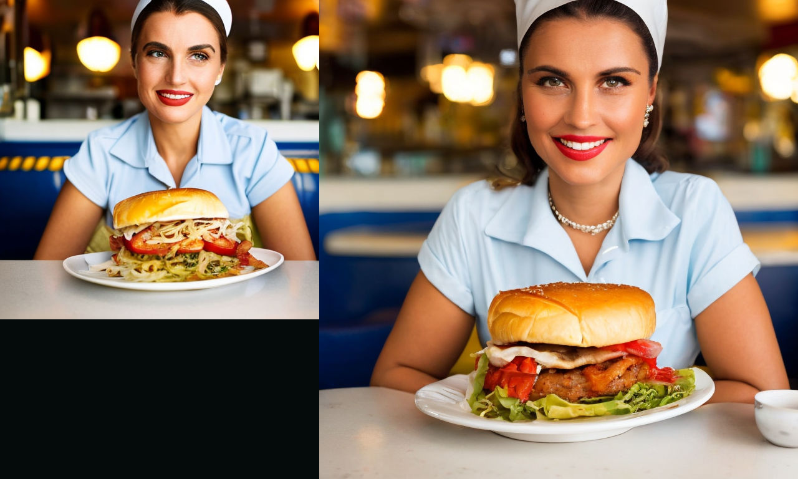
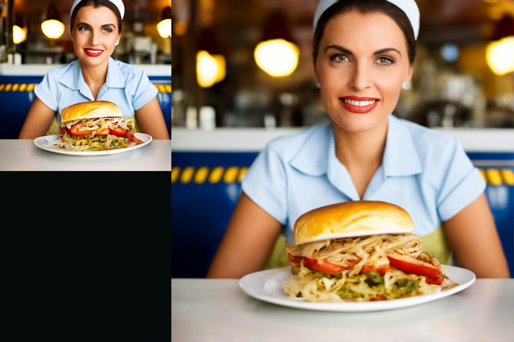
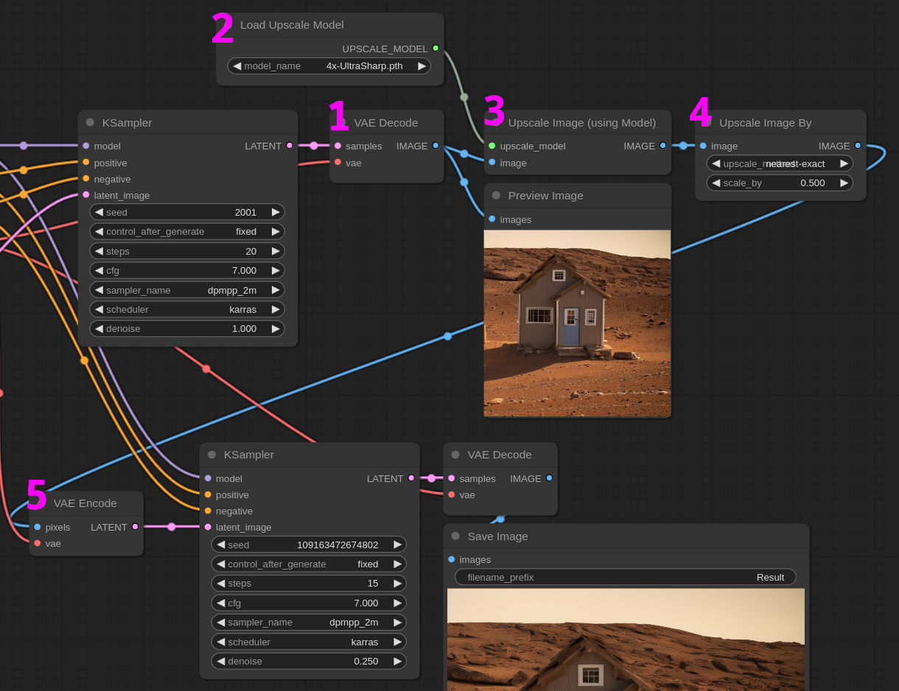
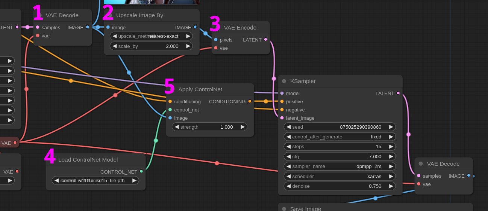

<!-- TOC -->

- [Upscale](#upscale)
    - [Upscale latent](#upscale-latent)
    - [Upscale pixels](#upscale-pixels)
    - [Upscale pixels by model](#upscale-pixels-by-model)
    - [Upscale latent in SDXL](#upscale-latent-in-sdxl)
    - [Upscale latent by model](#upscale-latent-by-model)
    - [Upscale with Tile ControlNet](#upscale-with-tile-controlnet)
- [Experiments](#experiments)
    - [Compare upscale models](#compare-upscale-models)
    - [Denoise impact on latent upscale](#denoise-impact-on-latent-upscale)
    - [Denoise impact on pixel upscale](#denoise-impact-on-pixel-upscale)

<!-- /TOC -->

# Upscale

This section explores various ways to upscale and apply *hires fix* to an image.

Before we continue it is important to understand two important concepts:

- Difference between Latent and Pixel space
- Difference between Traditional and Machine Learning based upscaler
- Impact of denoise

The image generation actually happens in what is called a "Latent space". Latent is where the GPU (or CPU) crunches all the data; that information needs to be interpreted by a model (the VAE) to be converted into pixels.

The latent decoding is a lossy process that requires computational power, and the bigger the image the more resources you'll need. That's why whenever possible we try to work inside the latent space and convert to pixels only at the very last stage.

To upscale an image or a latent we can use traditional algorithms like bicubic, bilinear, etc or machine learning models trained for this purpose.

Of course traditional methods are faster but the result is generally blurry depending on the upscaling factor. To get back the details and sharpness we can apply a **second pass** over the upscaled image.

That consists in passing the image to a second KSampler and playing with the `denoise` parameter.

The lower the denoise the closer the image will look to the original but also the less impactful the second pass will be. If you don't care if the final image is 1:1 to the original you can increase the denoise and get a very sharp result albeit slightly different from the starting generation.

If you want to stay close to the source you should instead use a low denoise.

When upscaling in the pixel space a denoise between **0.25 and 0.5** is sufficient to grant good results. Of course model based upscalers will require lower denoise as the upscaled image should be already rather good.

An upscaled latent instead is very noisy and you'll need a high denoise factor. Generally in the second pass you'll need at least **0.55 denoise**.

There are also model based latent upscalers like [NNLatentUpscale](https://github.com/Ttl/ComfyUi_NNLatentUpscale) and [SD Latent Upscaler](https://github.com/city96/SD-Latent-Upscaler), they are still experimental but it's worth trying them.

**To sum up:** once the image is upscaled with whatever method, use the lowest possible denoise factor that grants you the best result. Latent based upscaling is preferable whenever possible because it's less resource hungry.

Now to the workflows. Title links directly to the JSON file.

## [Upscale latent](./upscale_latent.json)

Upscaling the latent is the easiest and fastest of the methods.

In this workflow we upscale the latent by 1.5 times and apply a second pass with 0.7 denoise. Unfortunately the upscaled latent is very noisy so the end image will be quite different from the source. The upside is that we used very little resource.

Upscaled image

## [Upscale pixels](./upscale_pixel.json)

In this case we are upscaling the pixels. The source image has to be decoded from the latent space first then we apply a 2x upscale factor with a traditional interpolation.

Despite the upscaling factor being higher than the previous workflow we are able to use a denoise of 0.55 because the pixel upscaling is less noisy.

Upscaled image

## [Upscale pixels by model](./upscale_by_model.json)

This is where things get interesting. Arguably the best results can be achieved by using a model upscale in the pixel space. The following is a cut out of the workflow and that's where the action happens:

1. The source image needs to be decoded from the latent space first.

2. We need to load the upscale model next. In this example we are using [4x-UltraSharp](https://openmodeldb.info/models/4x-UltraSharp) but the are dozens if not hundreds available. There are no good or bad models, each one serves its purpose. Good models to start with can be: RealSR, Remacri, UltraSharp and they can all be found on [OpenmodelDB](https://openmodeldb.info/). In the [experiments](#Experiments) we offer an upscaler comparison workflow.

3. This is where the image is actually upscaled.

4. Most upscalers are trained to a fixed factor, generally 4x but you can find 8x, 3x, 2x or even 1x (they are usually denoising filters). The model we are using upscales to 4x so in this step we are downscaling the image by a factor of 0.5, effectively making the image 2x the original source.

5. Before the second pass we need to convert the image back to the latent space because SD can only work with latents, this is done with a VAE Encode node. The process may take some time and if you don't have enough VRAM the image will be automatically tiled and encoded in blocks. If that happens encoding will be significantly slower.

Now the upscaling is finished and the image is ready for the second pass. This time we are using just 0.25 denoise as we are working on an already good source. Note that we need very few steps in the second pass.

## [Upscale latent in SDXL](./upscale_latent_SDXL.json)

The same concepts we explored so far are valid for SDXL. In a base+refiner workflow though upscaling might not look straightforwad.

If you are not interested in having an upscaled image completely faithful to the original you can create a draft with the base model in just a bunch of steps, then upscale the latent and apply a second pass with the base and a third pass with the refiner.

**Note:** We are using the advanced KSampler in the second pass but we set the `start_at_step` to **5** instead of 0. That is the equivalent as setting a lower denoise factor in the base KSampler: `start_at_step = 0` is the same as `denoise = 1.0`. Being this workflow a latent upscale we need to keep this value relatively low, you can play a bit with it, but over a total of 20 steps a range of 3-5 is all that is usually allowed (that is the same as setting 0.6-0.7 denoise).

## [Upscale latent by model](./upscale_latent_with_model.json)

As we learned it is desirable to work as much as possible in the latent space without conversion back and forth from/to the pixel space. It is also true that upscaling the latent leads to very noisy results... unless you use a model.

Upscaling latents with a model is not as sharp as upscaling pixels but a lot better than using a standard upscale algorithm.

In this workflow we are using the [NNLatentUpscaler](https://github.com/Ttl/ComfyUi_NNLatentUpscale) extension that is compatible both with SD1.x and SDXL latents.

The upscaled image is a bit blurry but not noisy and we can get some detail back by applying a relatively low denoise second pass.

## [Upscale with Tile ControlNet](./upscale_tile_controlnet.json)

Tile is a very interesting [ControlNet](https://github.com/lllyasviel/ControlNet-v1-1-nightly). Be sure to [download it](https://huggingface.co/lllyasviel/ControlNet-v1-1/blob/main/control_v11f1e_sd15_tile.pth) and place it in the `ComfyUI/models/controlnet/` directory, we don't need a preprocessor for this workflow.

**Tile** takes an image and uses the color information as a reference to generate a new one. If you upscale an image generated in the first pass and perform a second pass using the same image as reference for Tile, the result will be incredibly detailed and close to the original.

This technique is so efficient and flexible that it is often used as go-to upscaling method.

1. Tile works in the pixel space, so we need to decode the latent.
2. The image is upscaled to 2x with a simple nearest-exact interpolation. We don't need a high resolution image as we are using a very high denoise value in the second pass.
3. The upscaled image is moved to the latent space and fed to a second sampler. Note that it is not strictly necessary to use the upscaled image as base for the second pass, you could technically use an empty latent and then use a denoise value of 1.0. With some experimentation though I find that the layout presented in this workflow offers better results.
4. We load the Tile control net
5. We apply the control net using the original (not upscaled) image as reference. We use the same text prompt as conditioning but it pass through the control net. We are using 1.0 as strength as we want the final image to be as close as possible to the orignal.

Finally we run the second pass. You can play with the controlnet strength and the denoise level to try to stay closer (or farther) to the source. By lowering the denoise value we get closer to the original image but we lose the sharpening effect of the second pass. `0.75` seems a good compromise but depends on the image.

# Experiments

## [Compare upscale models](./experiments/compare_upscale_models.json)

Very simple workflow to compare a few upscale models. You can find pixel upscale models on [OpenModelDB](https://openmodeldb.info/), if you don't know where to start from try: **UltraSharp**, **RealSR** or **Remacri**.

## [Denoise impact on latent upscale](./experiments/denoise_impact_on_latent.json)

As we talked in the [introduction](#upscale) upscaling the latent generates a lot of noise that needs to be compensated with a high `denoise` second pass.

This workflow shows the impact of 4 denoise levels on a latent upscaled image. Low denoise (`0.25`) won't be sufficient for generating acceptable results. You'll probably notice that the minimum is around `0.55`.

## [Denoise impact on pixel upscale](./experiments/denoise_impact_on_pixel.json)

This is similar to the previous experiment but this time we are upscaling the image in the pixel space with an upscaling model.

This time a `0.25` denoise is enough to reach satisfactiory results but sometimes a higher value will help in adding details and fixing small errors.